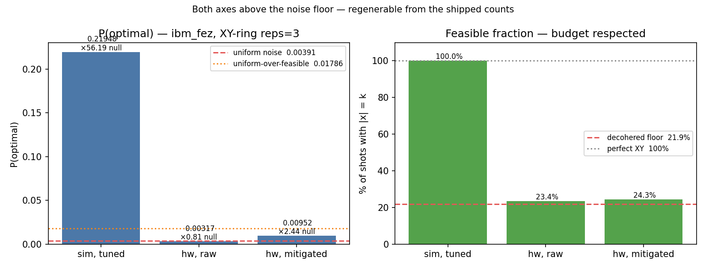

# Quantum-Safe DeFi Allocation Agents

[](https://quantum-portfolio-awhfbfwtbqmp2swgpsvxwf.streamlit.app/)
[](https://github.com/EmpowerTours/quantum-portfolio/actions/workflows/test.yml)

## Santander judges: start here

No installation, IBM Quantum account, wallet, or API key is required to review
the shipped demonstration.

1. **[Open the interactive Streamlit demo](https://quantum-portfolio-awhfbfwtbqmp2swgpsvxwf.streamlit.app/)** — run the cached optimizer, inspect AI forecasts and backtesting, verify the real IBM hardware artefacts, and exercise PQ signing/tamper detection. *Streamlit Community Cloud sleeps an app after a period of inactivity; if you land on a `Zzzz` screen, click **Yes, get this app back up!** and give it about a minute. A scheduled job pings it to keep that from happening, and the deck and every contract link below need no wake-up at all.*
2. **[Watch the 90-second product walkthrough](docs/DEMO_VIDEO.mp4)**.
3. **[Review the Santander submission narrative](SUBMISSION.md)** and the linked IBM Quantum jobs and Monad transactions.
4. **[Review the automated test results](https://github.com/EmpowerTours/quantum-portfolio/actions/workflows/test.yml)** — 267 Python tests plus 181 Foundry tests (448 total) are documented below. The 12 fork tests need a Monad RPC endpoint **and** the pool parameters, and skip without them; with `MONAD_RPC_URL`, `FORK_TOKEN_OUT` and `FORK_FEE` all set, nothing skips.
5. **[Read the business case](SUBMISSION.md#business-model-market-and-go-to-market)** — who buys this, why the 31 December 2031 deadline is the forcing function, how it is priced, and what we are asking Santander for.

**Traction, stated up front so it is not a discovery:** we have no customers, no
revenue and no letters of intent. What we have is shipped and checkable — four
Monadscan-verified contracts on Monad mainnet, one end-to-end run executed with
real value, 448 passing tests, and two IBM Heron QPU runs with published job IDs
and raw counts.

## Live on Monad mainnet (chainId 143)

Four contracts. Source and ABI are public for all of them; click any address.

| Contract | Address |
|---|---|
| **AuditAnchorV2** | [`0x8422b555DCE11913A4657C2f47C839637FC71ffd`](https://monadscan.com/address/0x8422b555dce11913a4657c2f47c839637fc71ffd) |
| **UniswapRoutingVault** | [`0xcC60db5E123Cb3150d5F11CA5526a79B4f31113F`](https://monadscan.com/address/0xcc60db5e123cb3150d5f11ca5526a79b4f31113f) |
| **MorphoSupplyAdapter** | [`0x6D42fA32880aDd1d794abBF98c5Cd104Fe332D89`](https://monadscan.com/address/0x6d42fa32880add1d794abbf98c5cd104fe332d89) |
| **MLDSAAttestationV2** | [`0xFeEf24A5dBF43E9dE8AC0d0EaB0f0141E980A52c`](https://monadscan.com/address/0xfeef24a5dbf43e9de8ac0d0eab0f0141e980a52c) |

All four are Monadscan-verified — source and ABI public. Confirm it yourself
without trusting this page:

```bash
curl -s "https://api.etherscan.io/v2/api?chainid=143&module=contract\
&action=getsourcecode&address=0xFeEf24A5dBF43E9dE8AC0d0EaB0f0141E980A52c\
&apikey=$ETHERSCAN_API_KEY" | jq -r '.result[0].ContractName'
```

**What changed on 2026-08-25.** `MLDSAAttestationV2` replaces a single
`immutable` `agentPkHash` with a reconfigurable *set* of authorised ML-DSA keys,
so the agent identity can now be rotated or recovered by signing instead of by
redeploying. Because `PQ()` is `immutable` on both executors, adopting it meant
redeploying them too — the last time that should be necessary. See
[zk-mldsa/README.md](zk-mldsa/README.md) for the design.

**Where the proof transactions live.** All seven transactions cited below ran
on 2026-08-26 against the contracts listed above — the V2-gated
`UniswapRoutingVault` `0xcC60db5E…113F`, `MorphoSupplyAdapter`
`0x6D42fA32…2D89`, `MLDSAAttestationV2` `0xFeEf24A5…A52c` and `AuditAnchorV2`
`0x8422b555…1ffd`. The evidence and the live addresses are the same set.

This was not true between 2026-08-25 and 2026-08-26, and the distinction is
worth keeping in mind when reading any such claim. The key-rotation migration
redeployed both executors, and because `PQ()` is immutable they got new
addresses — so for a day the documented proofs belonged to the **retired**
pair ([`0xDaEa22D6…5144`](https://monadscan.com/address/0xdaea22d6dcb37fbf1462d6d08ade40a8fac05144),
[`0xE3de9217…Ffa6`](https://monadscan.com/address/0xe3de921790d04656f2640fa1edd75492e911ffa6))
under the v1 attestation, while the addresses presented as live had never
carried a settlement. Both statements were individually true and the pairing
was misleading. The re-run closed it by executing the loop again, from a fresh
pair of ML-DSA signatures and Groth16 proofs, against the live set. The retired
contracts remain on chain, and their transactions are preserved in
`outputs/archive/`.

The 2026-08-10 redeploy before that bound execution in Solidity to the
post-quantum signature (`PQExecBinding`). Every one of these contracts is
immutable with no upgrade path, which is why each change means new addresses
rather than a patch. See [SECURITY.md](SECURITY.md) for what the earlier ones
did and did not enforce.

One end-to-end run, executed with real value on 2026-08-26:

| Step | Transaction | Effect |
|---|---|---|
| ZK attest | [`0x4cc8290b…c5e4`](https://monadscan.com/tx/0x4cc8290b5338b388750b7ea3b00ae47ebd0af86a9a5d38f1096e1337f70dc5e4) | Groth16 proof of the order's ML-DSA-65 signature verified on-chain |
| Anchor | [`0xfc44e9d4…b3b1`](https://monadscan.com/tx/0xfc44e9d4828d10a9e05444227cc0496df84451f6ef8ffc08822da8b0dad5b3b1) | commits the exact trade the signature authorises |
| Swap | [`0xa229f4a6…edfc6`](https://monadscan.com/tx/0xa229f4a6dc0b7421cca1cfa1e988cba30722dba0862677f4e8a75375e5cedfc6) | 0.1 MON → **2 755 micro-USDC** via live Uniswap v3, with the signed order preimage checked on-chain |
| ZK attest (yield) | [`0x0126b15a…d145`](https://monadscan.com/tx/0x0126b15ae20d9ccb723f87d0f7a35605279cb67c114e2ee51bcfda2a5542d145) | second Groth16 proof — the yield leg is its own signed order |
| Anchor (yield) | [`0x37b7fdfe…7afb`](https://monadscan.com/tx/0x37b7fdfec2f0a320c25e620675e75842eb8b3f2ca00c3b71f3c4f12e16ce7afb) | commits the exact market and ceiling the signature authorises |
| Yield | [`0x4b758d3a…c6007`](https://monadscan.com/tx/0x4b758d3abc5f86101ead5d19590986f6cd96d39f75f7489d0a4b085dfebc6007) | supplied into a live Morpho Blue market, position accruing |

The routing and yield legs carry **separate** orderHashes. `AuditAnchorV2`
stores one execution commitment per `(user, orderHash)` and refuses to
re-anchor, and both executors read that same slot expecting their own
commitment — so each leg needs its own ML-DSA signature, Groth16 proof and
attestation. That is the direct cost of binding an anchor to a concrete
execution rather than to a caller.

Amounts are deliberately tiny — about two-tenths of a US cent. The point is
that the contracts **refuse** anything the agent did not sign for, not the
size of the trade.

The live demo uses shipped, reproducible hardware artefacts by default. Running
new IBM hardware jobs is optional and requires a personal IBM Quantum token.

End-to-end pipeline for autonomous DeFi yield-pool selection that uses
hybrid quantum-classical optimisation and signs every rebalance order
with post-quantum cryptography.

- **Quantum**: portfolio QUBO solved with **reps-3 QAOA under an XY-ring
  mixer** (`src/xy_qaoa.py` — the mixer conserves Hamming weight, so the
  budget constraint holds by construction instead of via a penalty term) on
  real IBM Heron QPUs — `ibm_fez` for the stocks universe, `ibm_marrakesh`
  for the DeFi universe — raw and with XY4 dynamical decoupling + gate and
  measurement twirling for error suppression. Verifiable job IDs are baked
  into the artefacts. A penalty-mixer implementation remains in
  `src/qaoa_hw.py` for comparison; it is not what produced the shipped runs.
- **AI**: per-asset Ridge regression with technical features, trained
  walk-forward (no lookahead), feeds the QUBO's expected-return vector.
  Covariance is Ledoit-Wolf shrunk.
- **Hedged post-quantum security**: every rebalance order is triple-signed
  with **ML-DSA-65** (FIPS 204, lattice PQ), **SLH-DSA-SHAKE-256s**
  (FIPS 205, hash-based PQ, Level-5), and **Ed25519** (RFC 8032, classical).
  Three independent security assumptions — an attacker must break all
  three to forge an order. Nonces are tracked to prevent replay;
  mutated fields invalidate every signature; the audit log is
  hash-chained JSON-lines.
- **DeFi-native**: live data from DeFiLlama. Pool universe is
  Monad-primary (Morpho, Upshift, Neverland, shMONAD) plus Ethereum
  stablecoin pools for breadth.
- **Honest framing**: at this scale a classical exact solver is faster
  than the QPU. The value is the hybrid pipeline + error-mitigation
  demonstration + Q-Day-ready off-chain order layer.

This is the submission artefact for the **Santander X Global Challenge:
Quantum AI Leap** (application deadline 2026-06-30).

> **On the application area.** Our Phase 1 entry form records **Vertical 2 —
> Quantum Software and AI-Driven Intelligence**. This narrative is written
> Area-3-primary (*Digital Infrastructure Secured Against Quantum Threats*),
> because that is what the work turned out to be: the post-quantum settlement
> layer is the substance, and the quantum-optimisation layer is reported
> honestly as showing no advantage at this scale. We have written to the
> challenge administrators to ask which classification should stand. We are
> flagging the discrepancy rather than quietly picking whichever reads better. See [`SUBMISSION.md`](SUBMISSION.md) for the application
narrative and [`SECURITY.md`](SECURITY.md) for the threat model.

## Demo

```sh
python -m venv .venv && source .venv/bin/activate
pip install -r requirements.txt        # or use whichever package manager
streamlit run app.py
```

Tabs (left-to-right): **Run optimizer** (classical exact vs QAOA on
simulator), **AI forecasts** (Ridge predictions per pool), **Backtest**
(walk-forward monthly rebalance), **Hardware verification** (IBM Heron
results with clickable job IDs), **PQ signing** (interactive sign +
tamper test + audit log), **Methodology** (the architecture in plain
English).

## Verifiable hardware results

Two real-hardware runs, both **XY-ring-mixer QAOA at reps=3**, 8 qubits,
4096 shots — the stocks universe on `ibm_fez` and the DeFi universe on
`ibm_marrakesh` (IBM Heron, 156 qubits). Hardware error suppression: XY4
dynamical decoupling + gate and measurement twirling. Every figure below
recomputes from the raw counts shipped in `outputs/hardware_run*.json`;
`backend`, `mixer` and `reps` are recorded in those files.
Both runs find the same best 3-of-8 portfolio as the classical exact
solver, which is consistency at this scale (not advantage).

### DeFi pool universe (current, matches the pitch)

| | |
|---|---|
| Optimal selection | Morpho STEAKETH · Neverland USDC · shMONAD (all Monad) |
| Raw job ID | `d9mobuvurbec73e654n0` |
| Mitigated job ID | `d9moep7urbec73e657tg` |
| Single-run P(optimal) raw / mitigated | 0.537 % → 0.537 % (**22 vs 22** successes / 4 096 shots; Fisher exact **p = 1.000** — no measurable mitigation effect) |
| Feasible fraction | 33.5 % → 35.6 % (decohered floor 21.9 %) |

> **Read this honestly.** The XY mixer conserves the budget, so the feasible
> fraction (33.5 % vs a 21.9 % decohered floor) shows circuit structure
> survived. But conditioned on feasibility, P(optimal) is 0.0161 against a
> uniform-over-feasible baseline of 0.0179 — **at or below random**. The
> constraint survived; the optimisation did not. Contrast the stocks run
> above, where mitigation produced a significant effect. This run returned 22
> indistinguishable from chance, and we do not claim the QPU optimised
> anything in it. The dense all-to-all penalty transpiles to ~250 two-qubit
> gates on heavy-hex Heron, and at DeFi yield scale the covariance term is
> ~10⁻⁴ of the return term, so the instance degenerates towards a
> cardinality-constrained sort. This run already used the budget-preserving
> XY-ring mixer with feasible-subspace initialisation (`src/xy_qaoa.py`), so
> the mixer is not the missing piece here — the instance itself is close to
> degenerate at DeFi yield scale. The stocks run below, same mixer and same
> depth on a different backend, sits ~2.8σ above chance and is the stronger of
> the two. Full detail in SUBMISSION.md.

### Stocks universe — and the null that dismantles it

XY-ring mixer, reps=3, `ibm_fez`. Raw counts shipped in
`outputs/hardware_run.json`, so every figure below recomputes without an IBM
account — including the one that breaks the claim.

| | sim | hw raw | hw mitigated |
|---|---|---|---|
| Optimal found / 4096 | 899 | 13 | 39 |
| P(optimal \| feasible) | 0.2195 | 0.0136 | 0.0392 |
| vs `1/C(8,3)` = 0.0179 | ×12.3 | ×0.76 | ×2.19 |
| **vs an independent-bit null built from this run's own qubit marginals** | **×1.67** | **×0.64** | **×1.26** |

> **The ×2.19 does not survive a correct null.** `1/C(8,3)` assumes the eight
> qubits are unbiased. Measured per-qubit P(1) on that run is
> `0.510 0.405 0.421 0.455 0.440 0.579 0.585 0.415` against 0.375 for an
> unbiased weight-3 state. Against a null built from those marginals the
> mitigated lift is **×1.26, binomial p = 0.12** — indistinguishable from eight
> independently biased coins. The simulator still shows genuine multi-qubit
> structure (×1.67, p < 0.001); the hardware does not.
>
> We also ran the paired replication (20 runs, `ibm_marrakesh`) and found **no
> mitigation effect on P(optimal | feasible)** (p = 0.177), plus two
> methodological errors of our own — unseeded transpilation and a changed
> problem instance between sessions. Full detail, including what we withdrew,
> is in [SUBMISSION.md](SUBMISSION.md#the-replication--and-the-null-that-dismantles-our-own-headline).
>
> The original numbers stay visible above rather than being deleted. **The
> correction is the result.**



## Reproducing

**See SUBMISSION.md → "Reproducing the artefacts" for the two valid
review paths (A: verify the shipped state; B: rerun the pipeline fresh).
Path A is what reviewers should run first** — do NOT run
`python run_pq_demo.py` before the verification step, because it
overwrites the shipped `outputs/signed_orders.json` and produces a
new orderHash that will not match our on-chain anchors.

### Quick setup (one-time)

```sh
# Python 3.12 recommended (CI tests 3.11 and 3.12; 3.13 may break qiskit wheels).
python3.12 -m venv .venv && source .venv/bin/activate
pip install -r requirements.txt

# Foundry (if not installed):
curl -L https://foundry.paradigm.xyz | bash && foundryup

# Contract dependencies — PINNED to the versions the live mainnet contracts
# were compiled against on 2026-07-30. Unpinned, these resolve to whatever is
# on the default branch today, which is not the same build.
( cd contracts \
  && forge install foundry-rs/forge-std@v1.16.1 --shallow --no-git \
  && forge install OpenZeppelin/openzeppelin-contracts@v5.6.1 --shallow --no-git )
```

### Path A — verify the shipped artefact

```sh
# 1. Python tests (267). Seven of the eight modules use pytest fixtures or parametrisation, so
#    they must run under pytest — as plain scripts they error out.
pip install pytest && pytest tests/ -q

# 2. Foundry tests (181 across 26 suites). Bare, the 12 fork tests skip and you
#    get 169 passed, 12 skipped. For 181 passed / 0 skipped the fork suites need
#    the pool parameters too, not just an RPC endpoint — an RPC on its own runs
#    the two that need nothing else and still skips 10:
#      MONAD_RPC_URL=https://rpc.monad.xyz \
#      FORK_TOKEN_OUT=0x754704Bc059F8C67012fEd69BC8A327a5aafb603 FORK_FEE=3000 \
#      forge test
( cd contracts && forge test )

# 3. Re-derive the canonical-bytes SHA-256 of the shipped signed order:
python -c "
import sys, hashlib; sys.path.insert(0,'.')
from src import orders, pq_signing as pq
print(hashlib.sha256(pq.canonical_bytes(orders.load_signed_orders()[0].order.to_dict())).hexdigest())
"
# Expected: aee5fdf0e3ec0fcb68617877692b2e959061514da3757f91caf3bc3a229b3ee9

# 4. Ask Monad MAINNET what that order authorised. Keyed by orderHash, so no
#    later anchor can move it (V1's lastHash was last-write-wins, which is
#    why this instruction used to rot — see SUBMISSION.md).
cast call --rpc-url https://rpc.monad.xyz \
  0x8422b555DCE11913A4657C2f47C839637FC71ffd \
  "execCommitmentOf(address,bytes32)(bytes32)" \
  0x8df64bacf6b70f7787f8d14429b258b3ff958ec1 \
  0xb4eceb5893e4d68181706a8c3e08631cb24409880d1ccbd053082d1550a03325
# Expected: 0xe0a6ab379cd9f78d6df64b86eec5a899b0e9c4c2f6177761bdfb207b72ace116

# 5. Recompute every documented claim, including the commands above:
python verify_claims.py --chain
```

### Path B — exercise the pipeline from scratch

⚠️ **This overwrites the shipped `outputs/*.json` and appends to
`outputs/audit_log.jsonl`.** Back them up if you want Path A
reproducibility afterwards.

```sh
# 1. Re-run the QAOA on real hardware (needs IBM_QUANTUM_TOKEN in .env)
python run_hardware.py

# 2. Sign a NEW order under fresh keys (overwrites outputs/)
python run_pq_demo.py

# 3. Walk-forward backtest with AI-forecast μ
python run_backtest.py
```

## Project layout

```
.
├── app.py                       Streamlit UI (6 tabs)
├── run_demo.py                  Classical + QAOA-sim demo
├── run_hardware.py              QAOA on real IBM Heron QPU
├── run_backtest.py              Walk-forward backtest
├── run_pq_demo.py               PQ-sign a real hardware order
├── src/
│   ├── ai_forecast.py           Ridge regression forecasts
│   ├── backtest.py              Walk-forward engine
│   ├── data.py                  Yahoo-Finance stock-data layer
│   ├── defi_data.py             DeFiLlama yield-pool data layer
│   ├── hardware.py              IBM Quantum Runtime connection
│   ├── orders.py                RebalanceOrder + audit log
│   ├── pq_signing.py            Hedged signing: ML-DSA + SLH-DSA + Ed25519
│   ├── problem.py               Portfolio QUBO builder
│   ├── qaoa_hw.py               Hardware sampling + mitigation (penalty mixer, kept for comparison)
│   ├── solvers.py               Classical exact + QAOA-sim solvers
│   └── xy_qaoa.py               XY-ring-mixer QAOA — produced BOTH shipped hardware runs
├── contracts/                   Foundry sub-project (solc 0.8.28)
│   ├── foundry.toml
│   │  --- LIVE on Monad mainnet, Monadscan-verified ---
│   ├── src/AuditAnchorV2.sol          binds an order to the ONE execution it authorises
│   ├── src/UniswapRoutingVault.sol    routes native MON through production Uniswap v3
│   ├── src/MorphoSupplyAdapter.sol    supplies the proceeds into a live Morpho Blue market
│   │  --- superseded, retained for the historical trail ---
│   ├── src/AuditAnchor.sol            V1: recorded only lastHash[anchorer] (see SUBMISSION.md)
│   ├── src/MonadAllocationVault.sol   testnet native-MON vault
│   ├── src/RoutingVault.sol           testnet router over the in-repo MiniAMM
│   ├── src/dex/MiniAMM.sol            minimal V2-style AMM (testnet only)
│   │  --- tests ---
│   ├── test/AuditAnchorV2.t.sol       14 direct anchor tests + fuzz
│   ├── test/MorphoSupplyAdapterGuards.t.sol  11 guard tests (replay, ceiling, reentrancy)
│   ├── test/UniswapRoutingVault.t.sol 23 route, slippage, dust + allowance tests
│   ├── test/CommitmentParity.t.sol    Python↔Solidity commitment goldens
│   ├── test/redteam/RT01..RT11        70 adversarial tests reproducing each audit finding
│   └── script/Deploy*.s.sol           deploy scripts (chainId-guarded, capability-probed)
├── zk-mldsa/                    SP1 zkVM proof of the ML-DSA-65 signature
│   ├── program/                 guest: verifies the sig, commits (orderHash, pkHash)
│   ├── export_mldsa_input.py    refuses to export input signed by a non-live key
│   └── contracts/               MLDSAAttestation (live) + V2 with the key-rotation
│                                path, their deploy scripts, and 43 rotation tests
│                                (separate Foundry project, counted separately)
├── tests/
│   ├── test_pq_signing.py       32 PQ / canonicalisation / keypair-lifecycle tests
│   ├── test_monad_tx.py         36 calldata, commitment + route-validation tests
│   ├── test_quoter.py           18 live-quote tests (calldata pinned to `cast`)
│   ├── test_orders_auditlog.py  8 audit-chain normalisation tests
│   ├── test_pq_policy.py        17 negative tests for key pinning + hedge policy
│   ├── test_cvar_qaoa.py        13 CVaR objective + XY-mixer feasibility tests
│   ├── test_pq_rotation.py      17 agent-key rotation statements + Solidity parity
│   └── test_verify_claims.py    126 tests OF THE VERIFIER — plants every retired
│                                figure next to a heading and asserts the gate
│                                catches it (it silently stopped catching once)
│   (Plus 181 Foundry tests in contracts/test/ above — 448 tests total)
├── outputs/
│   ├── hardware_run.json        Cached IBM-QPU result
│   ├── backtest.json            Walk-forward metrics
│   ├── signed_orders.json       Signed-order aggregate
│   └── *.png                    Charts
├── SECURITY.md                  Threat model + reproducibility
└── SUBMISSION.md                Santander X application narrative
```

## Acknowledgements

QAOA comes from Farhi et al. (2014). The portfolio formulation follows
Mugel et al. (2022). The XY-mixer implementation in
`src/xy_qaoa.py` follows Hadfield et al. (2017) and is what produced both
shipped hardware runs. ML-DSA-65 follows NIST FIPS 204 (2024) and
SLH-DSA-SHAKE-256s follows NIST FIPS 205 (2024); both are provided by
`quantcrypt` (PQClean precompiled bindings). The Ed25519 classical leg
uses pyca's `cryptography` library. The triple-sign hedge construction
is the standard hybrid-PQ pattern (one lattice + one hash-based + one
classical signature with disjoint security assumptions).

## License

MIT — see [`LICENSE`](LICENSE).
